# Informe Tarea N°9

**Integrantes:**

Christian Bonifaz, Mateo Calderon, Josue Camacho, Luis Guevara

**NRC:** 5415

**Docente:** Ing. Darwin Alulema

**Tema:** Capitulo 23 (Transformadores y circuitos acoplados) y capitulo 24 (Sistemas de tres fases) de Análisis de Circuitos - Robbins, Miller

### 1. OBJETIVOS

- Clarificar el estudio de los Transformadores y circuitos acoplados, además de losSistemas de tres fases, todo esto aplicando los conocimientos aprendidos durante clases.

- Calcular el voltaje y la corriente en circuitos con transformadores con núcleo de hierro y núcleo de aire.

### 2. MARCO TEÓRICO

#### Capitulo 23 (Transformadores y circuitos acoplados)

#### Capitulo 24 (Sistemas de tres fases)

### 3. EXPLICACIÓN Y RESOLUCIÓN DE EJERCICIOS O PROBLEMAS

#### Capitulo 23 (Transformadores y circuitos acoplados)

**1. Para los transformadores de la figura 23-71, dibuje las formas de onda que faltan.**

**3. Un transformador ideal tiene Np=1000 vueltas y Ns=4000 vueltas.**

**a. ¿El voltaje se eleva o se reduce?**

**b. Si e_s=100 sen(ωt), ¿qué valor tiene ep cuando se devana como en la figura 23-7(a)?**

**c. Si E_s=24 volts, ¿qué valor tiene Ep?**

**d. Si E_p=24V<0° , ¿qué valor tiene Es cuando se devana como en la figura 23-7(a)?**

**e. Si E_p=800V<0°, ¿qué valor tiene Es cuando se devana como en la figura 23-7(b)?**

**5. Para la figura 23-72, determine las expresiones para v1, v2 y v3.**

**7. Si, para la figura 23-73, E_g=240V<0°, a=0.5 , e I_g=2A<20°, determine lo siguiente:**

**a. IL**

**b. VL**

**c. ZL**

**9. Si, para la figura 23-73, a=4, I_g=4 A<30°, y Z_L=6 Ω-j8 Ω, determine lo siguiente:**

**a. VL**

**b. Eg**

**11. Para cada circuito de la figura 23-74, determine Zp**

**13. Para la figura 23-74(a), ¿qué relación de vueltas se requiere para hacer que Z_p=(62.5-j125)Ω?**

**15. Para cada circuito de la figura 23-75, determine ZT.**

**17. Un transformador tiene una especificación de voltaje primario de 7.2 kV, a=0.2, y una especificación de corriente en el secundario de 3 A. ¿Cuál es la especificación de kVA?**

La especificación de kVA del transformador primario es:

La especificación de kVA del transformador secundario es:

Por lo tanto, la especificación del transformador de 108kVA

**19. El transformador de la figura 23-25 tiene un primario de 7200 V y un secundario de 240 V con terminal central. Si la carga 1 consiste en doce lámparas de 100 W, la carga 2 es un calentador de 1500 W y la carga 3 es un horno de 2400 W con Fp=1.0, determine**

Corriente a través de carga 1

Corriente a través de carga 2

Corriente a través de carga 3

a. I1 

b. I2 

c. IN 

d. Ip

**23. Para la figura 23-30(a), a2 = 2 y a3 = 5, Z2 = 20ohm∠50°, Z3 = (12 + j4) ohm y Eg = 120 V∠0°. Encuentre cada corriente de carga y la corriente del generador.**

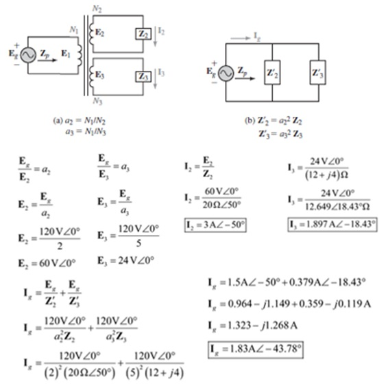

**25. Para la figura 23-77, Eg =1220 V∠0°.
a. Dibuje el circuito equivalente.
b. Determine Ig, IL, y VL.**

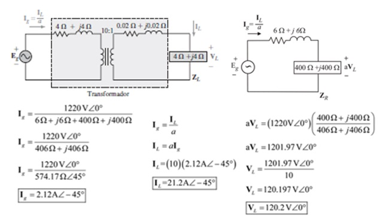

**27. Un transformador que entrega Psal = 48 kW tiene un pérdida en el núcleo de 280 W y una pérdida en el cobre de 450 W. ¿Cuál es su eficiencia a esta carga?**

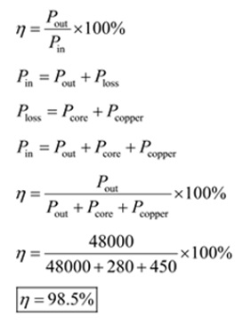

**29. Para la figura 23-78,
Para cada circuito indique qué signo usar con M, más o menos.**

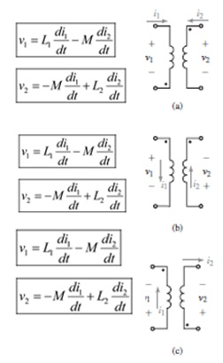

**31. Para un conjunto de bobinas acopladas, L1 = 2 H, M = 0.8 H y el coeficiente de acoplamiento es de 0.6. Determine L2**

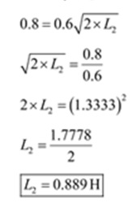

**33. Todo igual que en el problema 32, excepto que i1 = 10, e=500t A. Encuentre las ecuaciones de los voltajes del primario y el secundario. Calcúlelos a t = 1 ms.**

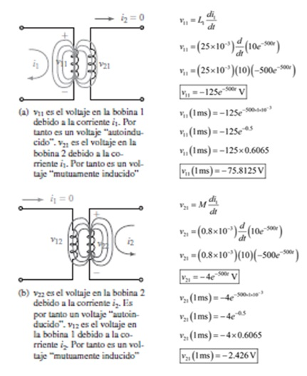

**35. Para la figura 23-80, determine LT.**

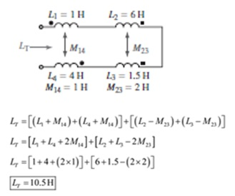

**37. Los inductores de la figura 23-82 están mutuamente acoplados. ¿Cuál es su inductancia equivalente? Si f = 60 Hz, ¿cuál es la corriente en la fuente?**

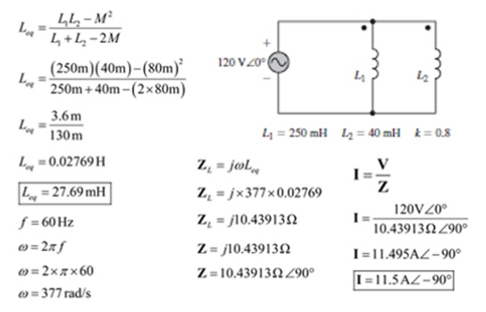

**39. Para el circuito de la figura 23-83, escriba las ecuaciones de malla**

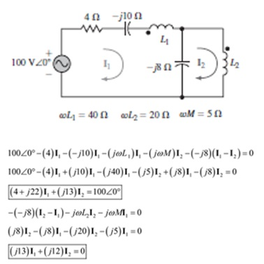

**41. Escriba las ecuaciones de malla para el circuito de la figura 23-85. (Este es un problema desafiante.)**

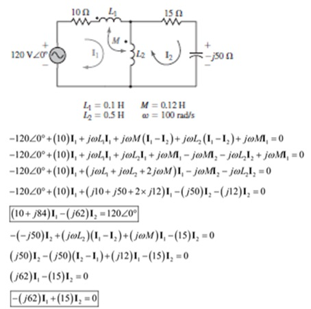

#### Capitulo 24 (Sistemas de tres fases)

**1. Mientras las cargas y voltajes de la figura 24-3(c) estén balanceados (sin tener en cuenta su valor real) las corrientes IA, IB, e IC sumarán cero. Para ilustrarlo, cambie la impedancia de carga de 12Ω  a 15Ω ∠30° y para EAA  120 V∠0°,haga lo siguiente:**

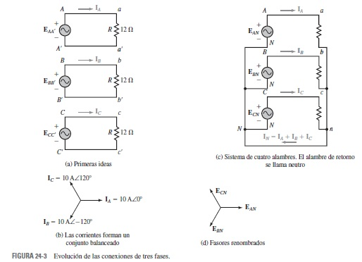

**a. Calcule las corrientes IA, IB e IC.**

**b. Sume las corrientes. ¿Se cumple IA + IB + IC = 0?**

**3. Dibuje el conjunto de formas de onda de las corrientes iA, iB e iC para el circuito de la figura 24-3(c). Suponga carga puramente resistiva y balanceada.**

**5. Para las cargas de la figura 24-4, Vbc = 208 V∠-75°.**

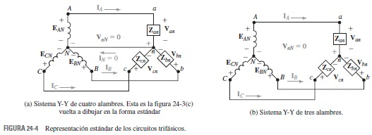

**a. Determine los voltajes línea a línea Vab y Vca.**

**b. Determine los voltajes de fase.**

**c. Dibuje el diagrama fasorial.**

**7. Para la carga de la figura 24-47, Van  347 V∠15°. Determine todas las corrientes de línea. Dibuje el diagrama fasorial.**

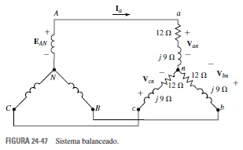

**9. Una carga Y balanceada tiene una impedancia de Zan = 14.7Ω ∠16°.Si Vcn = 120 V∠160°, determine todas las corrientes de línea.**

**11. Para el circuito de la figura 24-48, Vab = 480 V∠0°. Encuentre la fase y las corrientes de línea.**

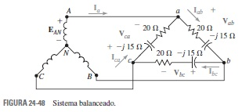

**13. Para el circuito de la figura 24-48, si Iab = 10 A∠21°, determine todos los voltajes de línea.**

**15. Una carga Y balanceada tiene una impedancia de fase de 24Ω ∠33° y un voltaje línea a línea de 600 V. Tome Van como referencia y determine todas las corrientes de línea.**

**17. a. Para cierta carga Y balanceada, Vab = 208 V∠30°, Ia = 24 A∠40° y f = 60 Hz. Determine la carga (R y L o C).**

**b. Repita el inciso (a) si Vbc = 208 V∠30° e Ic = 12 A∠140°.**

**19. Una carga Δ balanceada a 60 Hz tiene una corriente de Ibc = 4.5 A∠85°. El voltaje de línea es de 240 volts y Vab se toma como referencia.**

**a. Encuentre las otras corrientes de fase.**

**b. Encuentre las corrientes de línea.**

**c. Encuentre la resistencia R y la capacitancia C de la carga.**

**21. Para la figura 24-49, Van = 120 V∠0°. Dibuje el equivalente de una sola fase y:**

**a. Encuentre el voltaje de fase EAN, magnitud y ángulo.**

**b. Encuentre el voltaje de línea EAB, magnitud y ángulo.**

**23. Para la figura 24-48, EAN = 120 V∠10°. Encuentre la corriente de línea con el método equivalente de una sola fase.**

**25. Para la figura 24-48, suponga que las líneas tienen una impedancia Zlínea de 0.15Ω+j0.25Ω y EAN = 120 V∠0°. Convierta la carga Δ en Y y use el equivalente de una fase para encontrar las corrientes de línea.**

**27. Para el circuito de la figura 24-49, suponga que Zlínea= 0.15Ω + j0.25Ω  y Vab = 600 V∠30°. Determine EAB.**

**29. Los mismos datos que el problema 28 excepto que el voltaje de fase en la carga Δ es Vab = 480 V∠30°. Encuentre el voltaje del generador EAB, magnitud y ángulo.**

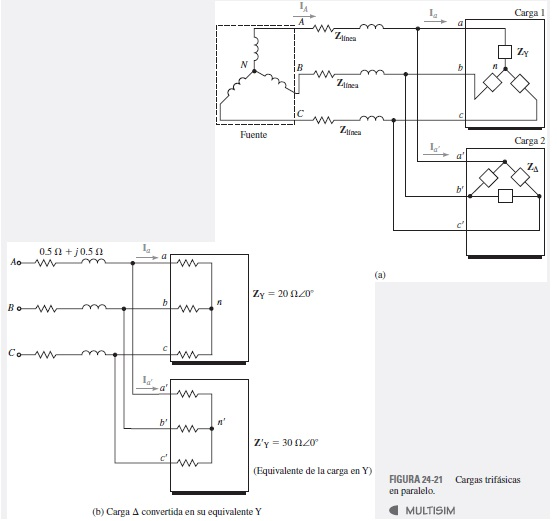

**31. Para la figura 24-21(a), ZY = 15Ω+j20 , ZΔ=9Ω- j12 , Zlínea =0.1Ω+ j0.1 , e Iab= 40A∠73.13°. Encuentre el voltaje de fase Y Van,magnitud y ángulo.**

**33. Repita el problema 32 para la carga balanceada de la figura 24-51, dado EAN = 120 V.**

**35. Para la figura 24-47, calcule las potencias real, reactiva y aparente con las fórmulas para PT, QT, y ST de la tabla 24-2. (Use VL  207.8 V en lugar del valor nominal de 208 V.) Compare sus resultados con los del problema 34.**

**37. Para la figura 24-48, EAB = 208 V. Calcule las potencias real, reactiva y aparente con las fórmulas para PT, QT, y ST de la tabla 24-2. Compare sus resultados con los del problema 36.**

**39. Para la figura 24-53, si Vab = 600 V, determine la potencia total, la potencia reactiva total, la potencia aparente total y el factor de potencia.**

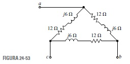

**41. Para la figura 24-19, si Vab = 480 V, determine la potencia total, la potencia reactiva total, la potencia aparente total y el factor de potencia.**

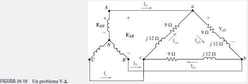

**43. Vab = 208 V para una carga balanceada Y, PT = 1200 W, y QT = 750 VAR/(ind). Seleccione Van como referencia y determine Ia. (Use el triángulo de potencia)**

**45. Los capacitores de la figura 24-54 están conectados en Y y cada uno tiene el valor de C = 120 uF. Calcule el factor de potencia resultante. La frecuencia es de 60 Hz.**

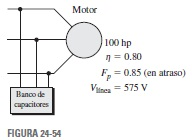

**47. Para la figura 24-47, el voltaje de fase del generador es de 120 volts.**

**a. Dibuje tres wattímetros correctamente en el circuito.**

**b. Calcule la lectura de cada uno.**

**c. Sume las lecturas y compárelas con el resultado de 2304 W que se obtuvo en el problema 34.**

**49. Para el circuito de la figura 24-56, Vab = 208 V∠30°.**

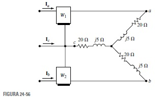

**a. Determine la magnitud y ángulo de las corrientes.**

**b. Determine la potencia por fase y la potencia total, PT.**

**c. Calcule las lecturas de cada wattímetro.**

**d. Sume las lecturas de los medidores y compare los resultados para PT de (b).**

**51. Considere el circuito de la figura 24-56.**

**a. Calcule el factor de potencia a partir del ángulo de las impedancias de fase.**

**b. En el problema 49 se determinaron las lecturas del wattímetro en Ph = 1164 W y Pl=  870 W. Sustituya estos valores en la ecuación 24-24 y calcule el factor de potencia de la carga. Compare sus resultados con los del inciso (a).**

**53. Para la figura 24-58, Rab = 60Ω , Zbc  80Ω+ j60Ω . Calcule**

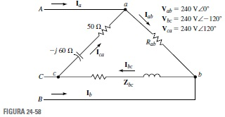

**a. Las corrientes de fase y de línea.**

**b. La potencia en cada fase y la potencia total.**

**55. Para la figura 24-59, calcule lo siguiente:**

**a. Las corrientes de línea, sus magnitudes y ángulos.**

**b. La corriente en el neutro.**

**c. La potencia en cada fase.**

**d. Potencia total en la carga.**

**57. A partir del problema 56, Ia = 1.94 A∠0.737°, Ib = 4.0 A∠117.7° e Ic = 3.57 A∠91.4°. Calcule lo siguiente:**

**a. Los voltajes en cada fase de la carga.**

**b. El voltaje entre el neutro de la carga y el neutro del generador.**

### 4. VIDEO

### 5. CONCLUSIONES 

- Los transformadores tienen muchas aplicaciones. Se usan en sistemas de potencia eléctrica para aumentar el voltaje en transmisiones a larga distancia y para disminuirlo luego otra vez a un nivel seguro para su empleo en casas y oficinas.

### 6. BIBLIOGRAFÍA

Robbins, A., & Miller, W. (2008). Análisis de circuitos. Estados Unidos: Cengage Learning.
